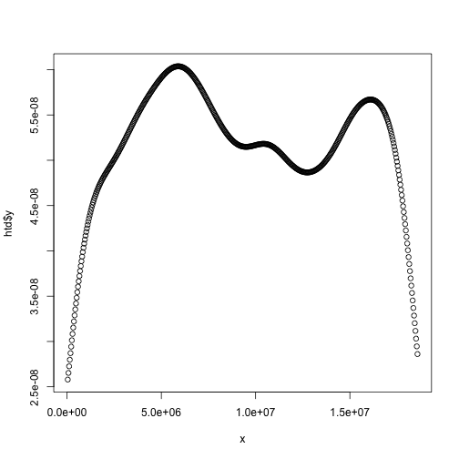
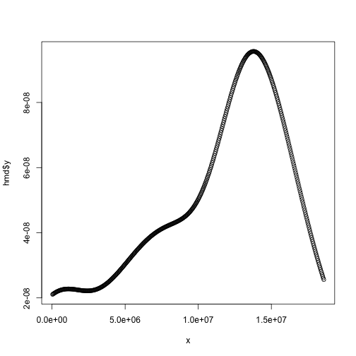
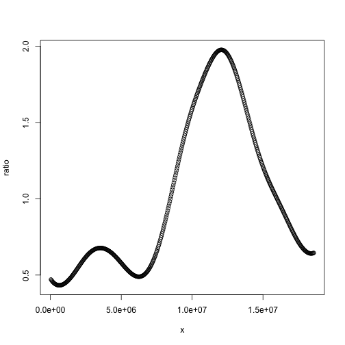
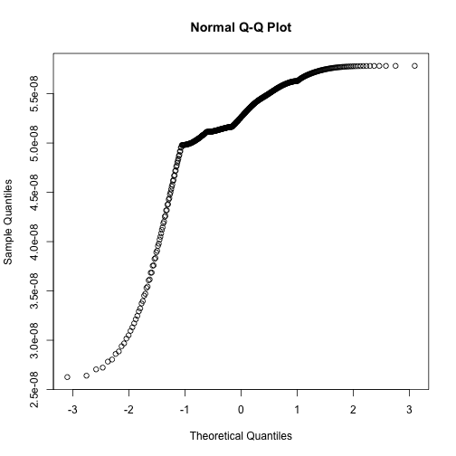
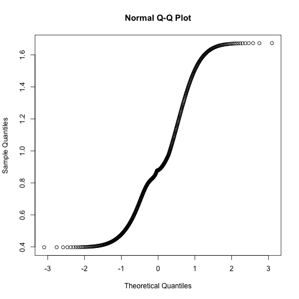

Progress 12/3/14
========================================================

Having noticed the genetic algorithm's inabilty to rearrange contigs correctly in it's current form, I have decided to test it with a model genome that has a ratio of homozygous to heterozygous SNP density that is normally distributed. This means I can use R's `qqnorm` to test the distribution for normality, rather than providing a sample distribution for qqplot, as I have been doing (in the fitness method of the genetic algorithm).

If I can prove that the genetic algorithm idea will work in this context, then I can apply the same priciple for real SNP position data, using a more realistic distribution than simply normal (based on what is found in literature.)


```r
hm <- rnorm(35, 1e+07, 5e+06)
remove <- c()
x <- 1
for (i in hm) {
    if (i < 0 || i > 18585056) {
        remove <- c(remove, x)
    }
    x <- x + 1
}
hm <- hm[-c(remove)]
ht <- runif(3000, 1, 18585056)

hmd <- density(hm, from = 0, to = 18585056)
htd <- density(ht, from = 0, to = 18585056)
ratio <- hmd$y/htd$y
x <- (1:512) * 36298.9375
plot(x, htd$y)
```

 

```r
plot(x, hmd$y)
```

 

```r
plot(x, ratio)
```

 


I have found a problem: I can test `hm` and `ht` with the `shapiro-wilks` test and `qqnorm` and show that `hm` is indeed normally distributed, and `ht` isn't. I don't have a way of testing the density vectors (and by extention the ratio) for normality. What I want is a way of testing normality of ratio. Ideally this method would work out the "normality" for hmd$y in the same way as shapiro and qqnorm do for hm, then this could be applied to the ratio.


```r
hm_test <- shapiro.test(hm)
qqp <- qqnorm(hm)
```

 

```r
cor(qqp$x, qqp$y)
```

```
## [1] 0.9739
```

```r

ht_test <- shapiro.test(ht)
qqp <- qqnorm(ht)
```

 

```r
cor(qqp$x, qqp$y)
```

```
## [1] 0.9767
```

```r

shapiro.test(hmd$y)
```

```
## 
## 	Shapiro-Wilk normality test
## 
## data:  hmd$y
## W = 0.9083, p-value < 2.2e-16
```

```r
qqp <- qqnorm(hmd$y)
```

 

```r
cor(qqp$x, qqp$y)
```

```
## [1] 0.9537
```

```r

shapiro.test(htd$y)
```

```
## 
## 	Shapiro-Wilk normality test
## 
## data:  htd$y
## W = 0.8725, p-value < 2.2e-16
```

```r
qqp <- qqnorm(htd$y)
```

 

```r
cor(qqp$x, qqp$y)
```

```
## [1] 0.9344
```

```r

shapiro.test(ratio)
```

```
## 
## 	Shapiro-Wilk normality test
## 
## data:  ratio
## W = 0.86, p-value < 2.2e-16
```

```r
qqp <- qqnorm(ratio)
```

 

```r
cor(qqp$x, qqp$y)
```

```
## [1] 0.9281
```

```r

hm_test
```

```
## 
## 	Shapiro-Wilk normality test
## 
## data:  hm
## W = 0.9436, p-value = 0.08655
```

```r
hm_test$p
```

```
## [1] 0.08655
```

```r

ht_test
```

```
## 
## 	Shapiro-Wilk normality test
## 
## data:  ht
## W = 0.9537, p-value < 2.2e-16
```

```r
ht_test$p
```

```
## [1] 7.847e-30
```


```r
div <- 1000
l <- 18585056
breaks <- c(0)
for (i in 1:div) {
    breaks <- c(breaks, (l/div) * i)
}
hmc <- hist(hm, breaks = breaks, plot = FALSE)$counts
htc <- hist(ht, breaks = breaks, plot = FALSE)$counts
```


I have decided to abandon this count idea that I have explored in my ruby class [SNPdist](https://github.com/edwardchalstrey1/fragmented_genome_with_snps/blob/normal/lib/snp_dist.rb), see [slash](https://github.com/edwardchalstrey1/fragmented_genome_with_snps/blob/normal/Progress/Slash.md) for continutation.
