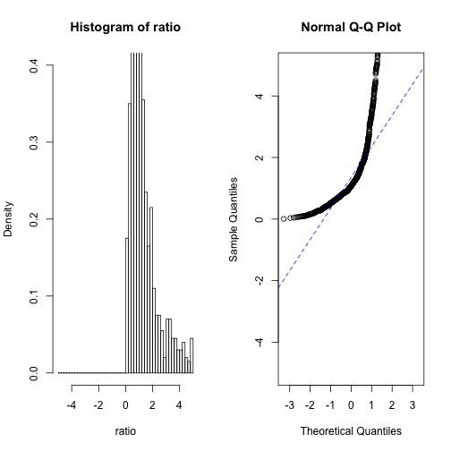

Progress 12/3/14
========================================================

Having noticed the genetic algorithm's inabilty to rearrange contigs correctly in it's current form, I have decided to test it with a model genome that has a ratio of homozygous to heterozygous SNP density that is normally distributed. This means I can use R's `qqnorm` to test the distribution for normality, rather than providing a sample distribution for qqplot, as I have been doing (in the fitness method of the genetic algorithm).

If I can prove that the genetic algorithm idea will work in this context, then I can apply the same priciple for real SNP position data, using a more realistic distribution than simply normal (based on what is found in literature.)


```r
hm <- rnorm(35, 1e+07, 5e+06)
remove <- c()
x <- 1
for (i in hm) {
    if (i < 0 || i > 18585056) {
        remove <- c(remove, x)
    }
    x <- x + 1
}
hm <- hm[-c(remove)]
hm
```

```
##  [1] 16359885  1260199  6934739 11467469 11489869 13135380 13834478
##  [8]  7137551  8139756 14705879  4467686 16725264 10419306   448798
## [15] 17753549 11953187 13948939 13641825 16435736  4085074  5798697
## [22] 11064630  8258940  2451098  2752508  5995206 14210443  5750641
## [29]  6993870 15250842 14507079  7492231
```

```r

ht <- runif(3000, 1, 18585056)
hmd <- density(hm, from = 0, to = 18585056)
htd <- density(ht, from = 0, to = 18585056)
ratio <- hmd$y/htd$y
x <- (1:512) * 36298.9375
plot(x, ratio)
```

 


I have found a problem: I can test `hm` and `ht` with the `shapiro-wilks` test and `qqnorm` and show that `hm` is indeed normally distributed, and `ht` isn't. I don't have a way of testing the density vectors (and by extention the ratio) for normality. What I want is a way of testing normality of ratio. Ideally this method would work out the "normality" for hmd$y in the same way as shapiro and qqnorm do for hm, then this could be applied to the ratio.


```r
shapiro.test(hm)
```

```
## 
## 	Shapiro-Wilk normality test
## 
## data:  hm
## W = 0.952, p-value = 0.1644
```

```r
qqp <- qqnorm(hm)
cor(qqp$x, qqp$y)
```

```
## [1] 0.9801
```

```r

shapiro.test(hm)
```

```
## 
## 	Shapiro-Wilk normality test
## 
## data:  hm
## W = 0.952, p-value = 0.1644
```

```r
qqp <- qqnorm(hm)
```

 

```r
cor(qqp$x, qqp$y)
```

```
## [1] 0.9801
```

```r

shapiro.test(hmd$y)
```

```
## 
## 	Shapiro-Wilk normality test
## 
## data:  hmd$y
## W = 0.9031, p-value < 2.2e-16
```

```r
qqp <- qqnorm(hmd$y)
```

 

```r
cor(qqp$x, qqp$y)
```

```
## [1] 0.951
```

```r

shapiro.test(ratio)
```

```
## 
## 	Shapiro-Wilk normality test
## 
## data:  ratio
## W = 0.9034, p-value < 2.2e-16
```

```r
qqp <- qqnorm(ratio)
```

 

```r
cor(qqp$x, qqp$y)
```

```
## [1] 0.9512
```


```r
l <- 18585056
div <- 100  #l/10000
breaks <- c(0)
for (i in 1:div) {
    breaks <- c(breaks, (l/div) * i)
}
fhm <- summary(cut(hm, breaks))
fht <- summary(cut(ht, breaks))
fratio <- fhm/fht
hm
```

```
##  [1] 16359885  1260199  6934739 11467469 11489869 13135380 13834478
##  [8]  7137551  8139756 14705879  4467686 16725264 10419306   448798
## [15] 17753549 11953187 13948939 13641825 16435736  4085074  5798697
## [22] 11064630  8258940  2451098  2752508  5995206 14210443  5750641
## [29]  6993870 15250842 14507079  7492231
```

```r
fhm
```

```
##        (0,1.86e+05] (1.86e+05,3.72e+05] (3.72e+05,5.58e+05] 
##                   0                   0                   1 
## (5.58e+05,7.43e+05] (7.43e+05,9.29e+05] (9.29e+05,1.12e+06] 
##                   0                   0                   0 
##  (1.12e+06,1.3e+06]  (1.3e+06,1.49e+06] (1.49e+06,1.67e+06] 
##                   1                   0                   0 
## (1.67e+06,1.86e+06] (1.86e+06,2.04e+06] (2.04e+06,2.23e+06] 
##                   0                   0                   0 
## (2.23e+06,2.42e+06]  (2.42e+06,2.6e+06]  (2.6e+06,2.79e+06] 
##                   0                   1                   1 
## (2.79e+06,2.97e+06] (2.97e+06,3.16e+06] (3.16e+06,3.35e+06] 
##                   0                   0                   0 
## (3.35e+06,3.53e+06] (3.53e+06,3.72e+06]  (3.72e+06,3.9e+06] 
##                   0                   0                   0 
##  (3.9e+06,4.09e+06] (4.09e+06,4.27e+06] (4.27e+06,4.46e+06] 
##                   1                   0                   0 
## (4.46e+06,4.65e+06] (4.65e+06,4.83e+06] (4.83e+06,5.02e+06] 
##                   1                   0                   0 
##  (5.02e+06,5.2e+06]  (5.2e+06,5.39e+06] (5.39e+06,5.58e+06] 
##                   0                   0                   0 
## (5.58e+06,5.76e+06] (5.76e+06,5.95e+06] (5.95e+06,6.13e+06] 
##                   1                   1                   1 
## (6.13e+06,6.32e+06]  (6.32e+06,6.5e+06]  (6.5e+06,6.69e+06] 
##                   0                   0                   0 
## (6.69e+06,6.88e+06] (6.88e+06,7.06e+06] (7.06e+06,7.25e+06] 
##                   0                   2                   1 
## (7.25e+06,7.43e+06] (7.43e+06,7.62e+06] (7.62e+06,7.81e+06] 
##                   0                   1                   0 
## (7.81e+06,7.99e+06] (7.99e+06,8.18e+06] (8.18e+06,8.36e+06] 
##                   0                   1                   1 
## (8.36e+06,8.55e+06] (8.55e+06,8.73e+06] (8.73e+06,8.92e+06] 
##                   0                   0                   0 
## (8.92e+06,9.11e+06] (9.11e+06,9.29e+06] (9.29e+06,9.48e+06] 
##                   0                   0                   0 
## (9.48e+06,9.66e+06] (9.66e+06,9.85e+06]    (9.85e+06,1e+07] 
##                   0                   0                   0 
##    (1e+07,1.02e+07] (1.02e+07,1.04e+07] (1.04e+07,1.06e+07] 
##                   0                   0                   1 
## (1.06e+07,1.08e+07]  (1.08e+07,1.1e+07]  (1.1e+07,1.12e+07] 
##                   0                   0                   1 
## (1.12e+07,1.13e+07] (1.13e+07,1.15e+07] (1.15e+07,1.17e+07] 
##                   0                   2                   0 
## (1.17e+07,1.19e+07] (1.19e+07,1.21e+07] (1.21e+07,1.23e+07] 
##                   0                   1                   0 
## (1.23e+07,1.25e+07] (1.25e+07,1.26e+07] (1.26e+07,1.28e+07] 
##                   0                   0                   0 
##  (1.28e+07,1.3e+07]  (1.3e+07,1.32e+07] (1.32e+07,1.34e+07] 
##                   0                   1                   0 
## (1.34e+07,1.36e+07] (1.36e+07,1.38e+07] (1.38e+07,1.39e+07] 
##                   0                   1                   1 
## (1.39e+07,1.41e+07] (1.41e+07,1.43e+07] (1.43e+07,1.45e+07] 
##                   1                   1                   0 
## (1.45e+07,1.47e+07] (1.47e+07,1.49e+07] (1.49e+07,1.51e+07] 
##                   1                   1                   0 
## (1.51e+07,1.52e+07] (1.52e+07,1.54e+07] (1.54e+07,1.56e+07] 
##                   0                   1                   0 
## (1.56e+07,1.58e+07]  (1.58e+07,1.6e+07]  (1.6e+07,1.62e+07] 
##                   0                   0                   0 
## (1.62e+07,1.64e+07] (1.64e+07,1.65e+07] (1.65e+07,1.67e+07] 
##                   0                   2                   1 
## (1.67e+07,1.69e+07] (1.69e+07,1.71e+07] (1.71e+07,1.73e+07] 
##                   0                   0                   0 
## (1.73e+07,1.75e+07] (1.75e+07,1.77e+07] (1.77e+07,1.78e+07] 
##                   0                   0                   1 
##  (1.78e+07,1.8e+07]  (1.8e+07,1.82e+07] (1.82e+07,1.84e+07] 
##                   0                   0                   0 
## (1.84e+07,1.86e+07] 
##                   0
```

```r
fht
```

```
##        (0,1.86e+05] (1.86e+05,3.72e+05] (3.72e+05,5.58e+05] 
##                  17                  28                  26 
## (5.58e+05,7.43e+05] (7.43e+05,9.29e+05] (9.29e+05,1.12e+06] 
##                  28                  30                  28 
##  (1.12e+06,1.3e+06]  (1.3e+06,1.49e+06] (1.49e+06,1.67e+06] 
##                  40                  29                  22 
## (1.67e+06,1.86e+06] (1.86e+06,2.04e+06] (2.04e+06,2.23e+06] 
##                  35                  29                  26 
## (2.23e+06,2.42e+06]  (2.42e+06,2.6e+06]  (2.6e+06,2.79e+06] 
##                  33                  23                  37 
## (2.79e+06,2.97e+06] (2.97e+06,3.16e+06] (3.16e+06,3.35e+06] 
##                  24                  32                  25 
## (3.35e+06,3.53e+06] (3.53e+06,3.72e+06]  (3.72e+06,3.9e+06] 
##                  27                  31                  39 
##  (3.9e+06,4.09e+06] (4.09e+06,4.27e+06] (4.27e+06,4.46e+06] 
##                  27                  32                  22 
## (4.46e+06,4.65e+06] (4.65e+06,4.83e+06] (4.83e+06,5.02e+06] 
##                  22                  41                  42 
##  (5.02e+06,5.2e+06]  (5.2e+06,5.39e+06] (5.39e+06,5.58e+06] 
##                  22                  41                  27 
## (5.58e+06,5.76e+06] (5.76e+06,5.95e+06] (5.95e+06,6.13e+06] 
##                  36                  28                  19 
## (6.13e+06,6.32e+06]  (6.32e+06,6.5e+06]  (6.5e+06,6.69e+06] 
##                  35                  22                  28 
## (6.69e+06,6.88e+06] (6.88e+06,7.06e+06] (7.06e+06,7.25e+06] 
##                  28                  28                  30 
## (7.25e+06,7.43e+06] (7.43e+06,7.62e+06] (7.62e+06,7.81e+06] 
##                  46                  30                  31 
## (7.81e+06,7.99e+06] (7.99e+06,8.18e+06] (8.18e+06,8.36e+06] 
##                  36                  23                  34 
## (8.36e+06,8.55e+06] (8.55e+06,8.73e+06] (8.73e+06,8.92e+06] 
##                  28                  24                  35 
## (8.92e+06,9.11e+06] (9.11e+06,9.29e+06] (9.29e+06,9.48e+06] 
##                  39                  23                  29 
## (9.48e+06,9.66e+06] (9.66e+06,9.85e+06]    (9.85e+06,1e+07] 
##                  27                  31                  36 
##    (1e+07,1.02e+07] (1.02e+07,1.04e+07] (1.04e+07,1.06e+07] 
##                  22                  34                  30 
## (1.06e+07,1.08e+07]  (1.08e+07,1.1e+07]  (1.1e+07,1.12e+07] 
##                  30                  25                  28 
## (1.12e+07,1.13e+07] (1.13e+07,1.15e+07] (1.15e+07,1.17e+07] 
##                  24                  27                  39 
## (1.17e+07,1.19e+07] (1.19e+07,1.21e+07] (1.21e+07,1.23e+07] 
##                  26                  34                  35 
## (1.23e+07,1.25e+07] (1.25e+07,1.26e+07] (1.26e+07,1.28e+07] 
##                  32                  28                  29 
##  (1.28e+07,1.3e+07]  (1.3e+07,1.32e+07] (1.32e+07,1.34e+07] 
##                  25                  34                  31 
## (1.34e+07,1.36e+07] (1.36e+07,1.38e+07] (1.38e+07,1.39e+07] 
##                  38                  35                  37 
## (1.39e+07,1.41e+07] (1.41e+07,1.43e+07] (1.43e+07,1.45e+07] 
##                  38                  20                  32 
## (1.45e+07,1.47e+07] (1.47e+07,1.49e+07] (1.49e+07,1.51e+07] 
##                  35                  25                  26 
## (1.51e+07,1.52e+07] (1.52e+07,1.54e+07] (1.54e+07,1.56e+07] 
##                  30                  37                  38 
## (1.56e+07,1.58e+07]  (1.58e+07,1.6e+07]  (1.6e+07,1.62e+07] 
##                  33                  31                  24 
## (1.62e+07,1.64e+07] (1.64e+07,1.65e+07] (1.65e+07,1.67e+07] 
##                  31                  26                  25 
## (1.67e+07,1.69e+07] (1.69e+07,1.71e+07] (1.71e+07,1.73e+07] 
##                  24                  40                  23 
## (1.73e+07,1.75e+07] (1.75e+07,1.77e+07] (1.77e+07,1.78e+07] 
##                  24                  29                  33 
##  (1.78e+07,1.8e+07]  (1.8e+07,1.82e+07] (1.82e+07,1.84e+07] 
##                  43                  23                  33 
## (1.84e+07,1.86e+07] 
##                  23
```

```r
fratio
```

```
##        (0,1.86e+05] (1.86e+05,3.72e+05] (3.72e+05,5.58e+05] 
##             0.00000             0.00000             0.03846 
## (5.58e+05,7.43e+05] (7.43e+05,9.29e+05] (9.29e+05,1.12e+06] 
##             0.00000             0.00000             0.00000 
##  (1.12e+06,1.3e+06]  (1.3e+06,1.49e+06] (1.49e+06,1.67e+06] 
##             0.02500             0.00000             0.00000 
## (1.67e+06,1.86e+06] (1.86e+06,2.04e+06] (2.04e+06,2.23e+06] 
##             0.00000             0.00000             0.00000 
## (2.23e+06,2.42e+06]  (2.42e+06,2.6e+06]  (2.6e+06,2.79e+06] 
##             0.00000             0.04348             0.02703 
## (2.79e+06,2.97e+06] (2.97e+06,3.16e+06] (3.16e+06,3.35e+06] 
##             0.00000             0.00000             0.00000 
## (3.35e+06,3.53e+06] (3.53e+06,3.72e+06]  (3.72e+06,3.9e+06] 
##             0.00000             0.00000             0.00000 
##  (3.9e+06,4.09e+06] (4.09e+06,4.27e+06] (4.27e+06,4.46e+06] 
##             0.03704             0.00000             0.00000 
## (4.46e+06,4.65e+06] (4.65e+06,4.83e+06] (4.83e+06,5.02e+06] 
##             0.04545             0.00000             0.00000 
##  (5.02e+06,5.2e+06]  (5.2e+06,5.39e+06] (5.39e+06,5.58e+06] 
##             0.00000             0.00000             0.00000 
## (5.58e+06,5.76e+06] (5.76e+06,5.95e+06] (5.95e+06,6.13e+06] 
##             0.02778             0.03571             0.05263 
## (6.13e+06,6.32e+06]  (6.32e+06,6.5e+06]  (6.5e+06,6.69e+06] 
##             0.00000             0.00000             0.00000 
## (6.69e+06,6.88e+06] (6.88e+06,7.06e+06] (7.06e+06,7.25e+06] 
##             0.00000             0.07143             0.03333 
## (7.25e+06,7.43e+06] (7.43e+06,7.62e+06] (7.62e+06,7.81e+06] 
##             0.00000             0.03333             0.00000 
## (7.81e+06,7.99e+06] (7.99e+06,8.18e+06] (8.18e+06,8.36e+06] 
##             0.00000             0.04348             0.02941 
## (8.36e+06,8.55e+06] (8.55e+06,8.73e+06] (8.73e+06,8.92e+06] 
##             0.00000             0.00000             0.00000 
## (8.92e+06,9.11e+06] (9.11e+06,9.29e+06] (9.29e+06,9.48e+06] 
##             0.00000             0.00000             0.00000 
## (9.48e+06,9.66e+06] (9.66e+06,9.85e+06]    (9.85e+06,1e+07] 
##             0.00000             0.00000             0.00000 
##    (1e+07,1.02e+07] (1.02e+07,1.04e+07] (1.04e+07,1.06e+07] 
##             0.00000             0.00000             0.03333 
## (1.06e+07,1.08e+07]  (1.08e+07,1.1e+07]  (1.1e+07,1.12e+07] 
##             0.00000             0.00000             0.03571 
## (1.12e+07,1.13e+07] (1.13e+07,1.15e+07] (1.15e+07,1.17e+07] 
##             0.00000             0.07407             0.00000 
## (1.17e+07,1.19e+07] (1.19e+07,1.21e+07] (1.21e+07,1.23e+07] 
##             0.00000             0.02941             0.00000 
## (1.23e+07,1.25e+07] (1.25e+07,1.26e+07] (1.26e+07,1.28e+07] 
##             0.00000             0.00000             0.00000 
##  (1.28e+07,1.3e+07]  (1.3e+07,1.32e+07] (1.32e+07,1.34e+07] 
##             0.00000             0.02941             0.00000 
## (1.34e+07,1.36e+07] (1.36e+07,1.38e+07] (1.38e+07,1.39e+07] 
##             0.00000             0.02857             0.02703 
## (1.39e+07,1.41e+07] (1.41e+07,1.43e+07] (1.43e+07,1.45e+07] 
##             0.02632             0.05000             0.00000 
## (1.45e+07,1.47e+07] (1.47e+07,1.49e+07] (1.49e+07,1.51e+07] 
##             0.02857             0.04000             0.00000 
## (1.51e+07,1.52e+07] (1.52e+07,1.54e+07] (1.54e+07,1.56e+07] 
##             0.00000             0.02703             0.00000 
## (1.56e+07,1.58e+07]  (1.58e+07,1.6e+07]  (1.6e+07,1.62e+07] 
##             0.00000             0.00000             0.00000 
## (1.62e+07,1.64e+07] (1.64e+07,1.65e+07] (1.65e+07,1.67e+07] 
##             0.00000             0.07692             0.04000 
## (1.67e+07,1.69e+07] (1.69e+07,1.71e+07] (1.71e+07,1.73e+07] 
##             0.00000             0.00000             0.00000 
## (1.73e+07,1.75e+07] (1.75e+07,1.77e+07] (1.77e+07,1.78e+07] 
##             0.00000             0.00000             0.03030 
##  (1.78e+07,1.8e+07]  (1.8e+07,1.82e+07] (1.82e+07,1.84e+07] 
##             0.00000             0.00000             0.00000 
## (1.84e+07,1.86e+07] 
##             0.00000
```

