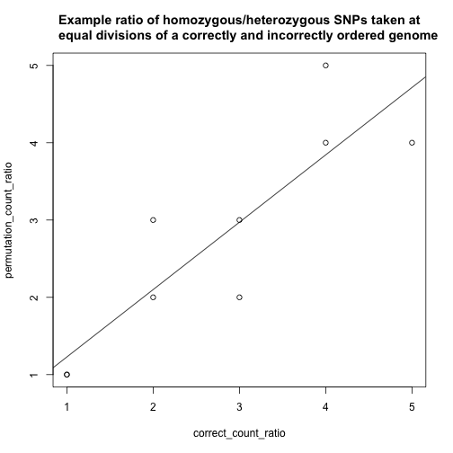

New fitness method 02/06/14
========================================================

I have created a new method for assesing the fitness of permutations, using the methods in [FitnessScore](https://github.com/edwardchalstrey1/fragmented_genome_with_snps/blob/master/lib/fitness_score.rb). The previous method involved the creation of a [hypothetical SNP distribution](https://github.com/edwardchalstrey1/fragmented_genome_with_snps/blob/master/Progress/Hypothetical_SNP_ratio/Hypothetical_SNP_ratio.md) that was an approximation of the ratio of homozygous/heterozygous SNPs. It used Q-Q plot to compare the distributions of permutations.

The new method, counts the numbers of each type of SNP, in equally sized divisions of the genome. The ratio of the homozygous/heterozygous count is then calculated for each of these divisions. Arrays of the count ratio for permutations can then be plotted against the array of count ratios for the correct arrangement of contigs. Taking the absolute Pearson's correlation coefficient will give us an indication of how similar the count ratios are, and how well the correct SNP distributions have been reformed by a given permutation.


```r
correct_count_ratio <- c(1, 2, 3, 4, 5, 4, 3, 2, 1)
permutation_count_ratio <- c(1, 3, 2, 4, 4, 5, 3, 2, 1)
plot(correct_count_ratio, permutation_count_ratio, main = "Example ratio of homozygous/heterozygous SNPs taken at\n     equal divisions of a correctly and incorrectly ordered genome")
abline(lm(permutation_count_ratio ~ correct_count_ratio))
```

 

```r
abs(cor(correct_count_ratio, permutation_count_ratio))
```

```
## [1] 0.8714
```


If we plot the count ratio across the correctly ordered genome with 100 divisions (for my smaller model genome, ```fitness score = 1.0```), the resultant figure looks like this:


For another permutation of the contigs with the same number of divisions (```fitness score = 0.7738701657151015```)


For these same two permutations, I can plot the ratio with my [hyp_snps method](https://github.com/edwardchalstrey1/fragmented_genome_with_snps/blob/master/lib/snp_dist.rb) that I [used previously](https://github.com/edwardchalstrey1/fragmented_genome_with_snps/blob/master/Progress/Hypothetical_SNP_ratio/Hypothetical_SNP_ratio.md) in calculating the fitness score.


