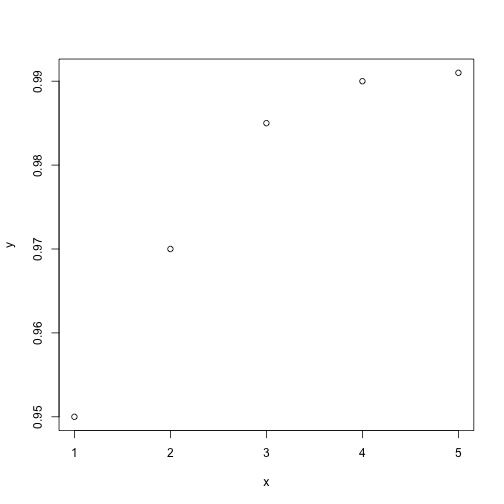

Genetic algorithm quit condition 02/06/14
========================================================

The genetic algorithm needs to stop when the correct permutation is reached, or it cannot improve the permutations with the best fitness score any further.
To achieve this I have added 3 quit conditions for the algorithm:

1. The best permutation measured in a generation has a fitness score of 1.0

2. A specified number of generations is reached (this is set to a number that is so high it is not expected the algorithm won't have already finished)

3. **The area under the curve of improvement does not increase by a certain percentage**

### Area under the curve

```n = number of generations```

```p = percentage of area under curve```

The fitness scores of best permutations from the last ```n``` generations are added to an array/vector. This vector plotted against x values that represent each generation, and the slope is calculated.


```r
y <- c(0.95, 0.97, 0.985, 0.99, 0.991)
x <- 1:length(y)
plot(x, y)
```

 

```r
require(pracma)
```

```
## Loading required package: pracma
```

```r
trapz(x, y)
```

```
## [1] 3.916
```


If the area under the curve calculated by trapz for the last ```n``` generations is less than ```p```% larger than the area under the curve for the previous ```n``` generations, the improvement is judged to be negligible. The algorithm loop is ended.
