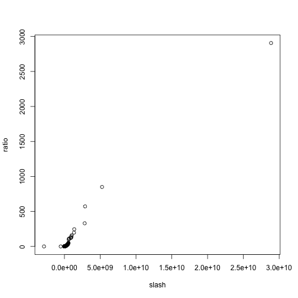
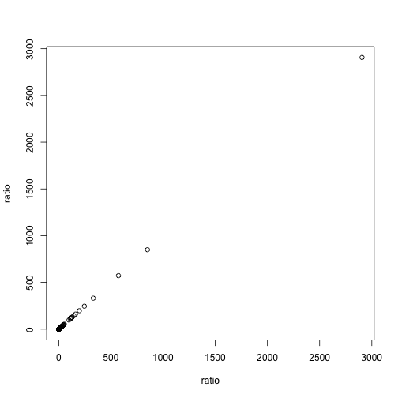

Progress 18/3/14
========================================================

It turns out that the ratio of a normal distribution to a uniform distribution is a *slash* distribution:


```r
# Homozygous SNP list (normal)
hm <- rnorm(10000, 1e+07, 5e+06)
remove <- c()
x <- 1
for (i in hm) {
    if (i < 0 || i > 18585056) {
        remove <- c(remove, x)
    }
    x <- x + 1
}
hm <- hm[-c(remove)]

# Heterozygous SNP list (uniform)
ht <- runif(10000, 1, 18585056)

# Ratio of samples
ratio <- sample(hm, 1000)/sample(ht, 1000)  # numer. and denom. must be same length
```


I have decided that a good way to work out the ratio is by taking samples of the SNP distributions, then calculating the ratio of the sample vectors. With the SNP lists I was using in [New_Model_Genome](https://github.com/edwardchalstrey1/fragmented_genome_with_snps/blob/normal/Progress/New_Model_Genome.md), this would not have been useful, as the number of homozygous SNPs in the model was so low.
From consulting literature that describes the kind of back-cross experiment I am modelling, including [Uchida et al (2011)](http://pcp.oxfordjournals.org/content/52/4/716.long), I have concluded that the actual numbers of SNPs can vary largely, based on the specific experiment. For subsequent versions of my model genome, I will use 10,000 of each kind of SNP. I can try and use experimental SNP data once I have got the genetic algorithm to re-order contigs from the model.


```r
par(mfrow = c(1, 2))  # puts 2 plots side by side

# Histogram of ratio
hist(ratio, xlim = c(-5, 5), breaks = c(-Inf, seq(-5, 5, 0.2), Inf), freq = F, 
    ylim = c(0, 0.7))

# Normal Q-Q plot
qqnorm(ratio, ylim = c(-5, 5))
qqline(ratio, xlim = c(-5, 5), lty = 2, col = "blue")
```

 


As the above figures show, the ratio does not follow a normal distribution. Instead, as illustrated by the example below, we will have a slash distribution.


```r
set.seed(123)
X <- rnorm(10000)
Y <- runif(10000)
Z <- X/Y
dslash <- function(x) (dnorm(0) - dnorm(x))/x^2

x <- seq(-5, 5, 0.02)
hist(Z, xlim = c(-5, 5), breaks = c(-Inf, seq(-5, 5, 0.2), Inf), freq = F, ylim = c(0, 
    0.4))
lines(x, dslash(x), xlim = c(-5, 5), col = "red")
lines(x, dnorm(x), xlim = c(-5, 5), col = "blue", lty = 2)
```

 

```r

qqnorm(Z, ylim = c(-5, 5))
qqline(Z, xlim = c(-5, 5), lty = 2, col = "blue")
```

 


If the ratio follows the slash distribution, then we should be able to use Q-Q plot to compare it with an example slash.


```r
plot(density(ratio))
```

 

```r
library("VGAM", lib.loc = "/Library/Frameworks/R.framework/Versions/3.0/Resources/library")
```

```
## Warning: package 'VGAM' was built under R version 3.0.2
```

```
## Loading required package: splines
## Loading required package: stats4
## 
## Attaching package: 'VGAM'
## 
## The following object is masked _by_ '.GlobalEnv':
## 
##     dslash
## 
## The following object is masked from 'package:stats4':
## 
##     coef
## 
## The following object is masked from 'package:splines':
## 
##     bs, ns
## 
## The following objects are masked from 'package:stats':
## 
##     case.names, coef, coefficients, df.residual, dfbeta, fitted,
##     fitted.values, formula, hatvalues, poly, residuals,
##     variable.names, weights
## 
## The following object is masked from 'package:base':
## 
##     identity, scale.default
```

```r
slash <- rslash(1000, mu = 1e+07, sigma = 5e+06)
plot(density(slash))
```

 

```r
qqp <- qqplot(slash, ratio)
```

 

```r
qqplot(ratio, ratio)
```

 

```r
ratio
```

```
##    [1] 1.389e+00 8.592e-01 7.304e-01 2.059e-01 1.997e-01 2.454e+00
##    [7] 1.607e+02 3.190e-01 5.546e-01 5.102e+00 7.197e-01 6.191e-01
##   [13] 4.336e-01 7.178e+00 5.782e-01 9.505e-01 9.569e-01 2.111e-01
##   [19] 8.499e-01 7.049e+00 2.231e-01 1.028e+00 3.540e+01 1.286e+00
##   [25] 7.158e-01 6.606e+00 1.511e+00 1.473e+00 4.868e-01 7.106e-01
##   [31] 6.037e-01 2.830e+00 1.276e+00 7.205e-01 3.841e-01 1.682e+00
##   [37] 5.760e-01 8.060e-01 9.665e-01 6.337e-01 1.079e+00 8.940e-01
##   [43] 1.263e+00 1.338e+00 2.744e-01 4.069e-01 7.802e-01 3.862e+00
##   [49] 9.770e-01 3.870e-01 6.329e-01 9.751e-01 2.406e+00 1.076e+00
##   [55] 7.557e-01 7.600e-01 2.497e+00 1.049e+01 6.120e-01 1.169e+01
##   [61] 4.870e+00 5.503e+00 5.553e-01 9.401e-01 1.260e+01 3.973e+00
##   [67] 8.501e+02 5.511e-01 8.896e-01 1.658e-01 1.070e+00 1.150e-01
##   [73] 2.901e+00 1.881e+00 7.495e-01 1.132e+00 3.020e-01 6.369e-01
##   [79] 5.999e-01 5.315e-01 6.505e-01 1.573e+00 7.822e-01 1.112e+00
##   [85] 3.067e-01 1.321e+00 6.084e+00 2.212e+00 1.023e+00 3.661e-01
##   [91] 1.144e+00 6.245e-01 8.159e-01 3.397e+01 5.689e-01 9.748e-01
##   [97] 2.293e+00 3.892e-01 8.626e-01 2.983e+00 4.491e+00 1.538e+00
##  [103] 1.485e+00 8.814e+00 6.377e-01 1.145e+02 4.013e-01 6.292e-01
##  [109] 4.130e-01 3.160e-01 1.290e+00 6.676e-01 1.186e+00 8.030e-01
##  [115] 5.549e-01 5.998e-01 6.348e-01 1.232e+01 2.540e+00 1.398e+00
##  [121] 3.972e-01 1.144e+00 4.910e-01 1.140e+00 6.106e-01 4.640e+00
##  [127] 9.384e-01 3.543e+00 2.925e+00 8.872e-01 4.543e+00 1.246e+00
##  [133] 1.644e+00 1.756e+00 2.981e-01 1.293e+00 8.790e+00 9.504e-01
##  [139] 7.102e-01 9.640e-01 1.392e+00 9.915e-01 8.972e-01 4.693e-01
##  [145] 6.764e-01 8.645e+00 5.337e+00 8.353e-01 4.256e-01 5.491e-01
##  [151] 2.126e+00 1.098e+02 2.263e+00 5.320e+00 1.174e+00 3.325e+00
##  [157] 1.785e+00 7.185e+00 1.075e+00 4.084e-01 6.580e-01 4.496e-01
##  [163] 7.767e-01 7.002e+00 8.013e-01 2.215e+00 1.284e+00 2.326e+00
##  [169] 3.762e+00 8.205e-01 4.154e-02 3.920e-01 2.648e+00 3.952e-01
##  [175] 3.517e+00 9.003e-01 7.117e+00 6.171e+00 3.463e-01 1.766e+00
##  [181] 7.872e-01 2.296e-01 2.576e+00 6.815e-01 2.918e+00 1.371e-01
##  [187] 1.118e+00 9.548e-01 5.136e-01 3.924e+00 1.935e-01 2.663e+00
##  [193] 5.684e-01 7.983e-01 5.575e-01 4.725e+00 8.158e+00 4.139e-01
##  [199] 1.336e+01 4.931e-01 9.326e-02 1.659e+00 9.691e-02 5.913e+00
##  [205] 9.141e-01 9.905e-01 3.209e+00 1.106e+00 1.247e+00 4.904e-01
##  [211] 4.876e-01 8.924e-01 7.309e-01 4.625e+00 4.815e-01 3.283e-01
##  [217] 3.850e-01 4.619e-01 1.787e+00 1.052e+00 6.287e-01 3.442e+00
##  [223] 3.579e-01 4.592e-01 5.090e-01 1.583e+00 6.548e-01 3.498e+00
##  [229] 4.445e-01 8.146e-01 1.463e+00 7.052e-01 1.299e+00 6.413e-01
##  [235] 1.163e+00 2.104e+01 9.449e-01 3.218e+00 9.546e-01 8.549e-01
##  [241] 6.854e-01 1.941e+00 1.024e+00 1.428e+00 1.906e+00 4.113e+00
##  [247] 1.398e+00 1.988e+00 1.600e+00 1.769e+00 2.954e+00 8.981e-01
##  [253] 8.899e-01 1.830e+00 2.155e+00 2.761e+00 1.655e+00 9.131e-01
##  [259] 3.455e+00 1.177e+00 1.308e+00 2.633e+00 1.204e+00 8.522e-01
##  [265] 1.035e+00 1.196e+00 2.171e+00 1.135e+00 1.017e+00 1.414e+00
##  [271] 4.044e+00 2.813e+00 1.259e+00 2.214e-01 5.799e+00 5.847e-01
##  [277] 2.298e+00 7.105e-01 3.545e-01 6.596e-01 8.190e-01 3.092e+00
##  [283] 1.302e+00 1.923e+00 2.485e-01 2.544e+00 1.592e-01 5.219e+00
##  [289] 1.142e+00 1.001e+00 3.044e+01 1.758e+00 3.464e-01 1.302e+00
##  [295] 3.518e+00 2.275e+00 5.184e-01 5.193e-01 1.951e-01 4.354e+00
##  [301] 4.716e-01 6.428e-01 9.298e-01 1.721e+00 7.983e-01 5.299e+00
##  [307] 7.699e-01 3.449e-01 1.189e+00 3.517e-01 6.580e-01 1.091e+00
##  [313] 1.097e+01 5.378e-01 5.694e-01 8.367e-01 1.201e+00 8.910e-01
##  [319] 1.220e-01 1.870e+00 7.738e-01 6.705e-01 3.358e-01 1.379e+00
##  [325] 9.429e-01 3.622e+00 1.035e+00 3.264e-01 7.160e-02 1.207e+00
##  [331] 1.986e+00 3.225e-01 2.315e+00 5.664e-01 8.390e-01 6.049e+00
##  [337] 1.796e+00 1.549e+00 1.448e+02 6.720e-01 3.641e-01 8.130e-01
##  [343] 1.436e+00 2.801e+01 1.029e+00 9.352e-01 5.887e-01 1.298e+01
##  [349] 8.449e-01 4.552e+00 5.043e+00 8.346e-01 3.108e+00 4.921e-01
##  [355] 8.414e-01 3.636e-01 1.024e+01 8.688e-01 1.010e+00 1.613e+00
##  [361] 7.887e-01 1.306e+00 6.661e-01 7.986e+00 9.891e-01 5.317e+00
##  [367] 9.511e+00 7.294e-01 6.472e-01 5.611e+00 8.513e-01 7.874e-01
##  [373] 3.637e-01 1.662e-01 3.503e-01 2.223e+01 2.280e+01 9.791e+01
##  [379] 8.978e-01 4.552e-01 3.057e-01 3.418e-01 9.025e-01 1.067e+01
##  [385] 1.276e+00 1.326e+00 7.505e+00 5.141e-01 1.182e-01 5.258e+00
##  [391] 3.912e-01 1.117e+00 7.933e-01 1.454e+00 2.007e+00 3.389e+00
##  [397] 6.287e-01 2.930e+00 6.297e-01 3.151e-01 3.387e-01 6.662e-01
##  [403] 6.575e-01 6.627e-01 1.566e-01 1.288e+00 8.898e-01 7.306e-01
##  [409] 1.199e+00 2.607e+00 1.083e+00 1.584e+00 1.343e+00 1.355e+00
##  [415] 5.630e-01 8.046e-01 1.055e+00 1.482e+01 2.080e+00 7.667e-01
##  [421] 1.501e+00 1.994e+00 8.496e-01 3.999e+00 8.641e+00 4.159e+00
##  [427] 2.054e+00 2.528e+00 8.985e-01 9.620e-01 1.467e+00 8.230e-01
##  [433] 1.104e+00 1.269e+00 1.038e+01 7.051e-01 7.294e-01 1.014e+00
##  [439] 3.674e+00 5.654e-01 1.053e+00 2.991e-01 4.488e+01 3.215e+00
##  [445] 1.978e+01 4.689e+00 2.151e-01 3.704e+00 1.200e-01 1.262e+00
##  [451] 5.098e-01 1.101e+00 5.307e+01 2.235e+00 1.040e+00 8.557e-01
##  [457] 8.419e-01 2.400e+00 5.693e-01 1.412e+00 3.123e+00 2.125e+00
##  [463] 9.627e-01 1.761e+00 2.813e-01 3.668e-01 2.740e+00 5.640e+00
##  [469] 1.695e+00 9.802e-01 3.400e+00 1.662e+00 4.223e-01 9.184e-01
##  [475] 4.827e-01 2.080e-01 7.893e-01 2.031e+00 8.996e-02 1.784e-01
##  [481] 1.681e+00 3.531e-01 9.922e-01 1.165e+00 1.438e-01 1.801e+00
##  [487] 9.671e-01 2.588e+00 1.127e+00 2.442e-01 2.757e-01 3.916e-01
##  [493] 3.562e-01 5.915e-01 3.307e+00 2.375e+00 1.239e+00 1.062e+00
##  [499] 5.201e-01 4.236e-01 1.632e+00 6.679e-01 7.404e+00 1.218e+01
##  [505] 1.082e+00 6.068e-01 2.604e+00 2.099e+00 2.429e-01 7.305e-01
##  [511] 8.680e-01 9.009e-01 5.374e+00 2.777e+00 9.105e-01 4.965e-01
##  [517] 1.618e+00 2.203e+00 1.690e+00 2.358e+00 5.693e+00 1.322e+00
##  [523] 9.633e-01 2.474e+00 2.413e-01 2.016e+00 2.653e-01 2.688e-01
##  [529] 9.211e+00 3.728e+00 7.628e-01 8.828e-01 5.162e-01 1.496e+00
##  [535] 1.184e+00 7.031e+00 1.136e+00 7.726e-01 1.333e+00 1.100e+01
##  [541] 3.146e-01 4.247e-01 1.426e+00 3.166e-01 7.590e-01 3.101e+00
##  [547] 1.105e-01 1.577e+00 4.779e-01 1.421e-01 2.770e+00 3.398e+00
##  [553] 8.136e-01 1.763e+00 1.428e+00 5.209e-01 6.182e-01 7.880e-01
##  [559] 1.806e+00 3.378e+00 4.086e+00 6.196e+00 5.200e-01 2.130e+01
##  [565] 5.576e-01 6.487e-01 6.518e-01 9.372e-01 1.231e+00 4.863e-01
##  [571] 5.000e+00 5.722e+02 7.103e-01 4.059e+00 8.133e-01 3.760e-01
##  [577] 1.313e+00 2.660e+01 8.685e+00 9.948e-01 1.193e+00 2.098e+00
##  [583] 3.712e+00 3.282e+00 1.030e+00 3.621e-01 1.095e+00 1.052e+00
##  [589] 2.627e-01 5.436e-01 3.069e-01 1.022e+00 1.799e+00 3.938e+00
##  [595] 5.571e-01 3.014e-01 4.113e+00 1.854e+00 2.049e-01 1.266e+02
##  [601] 4.094e-01 2.213e+00 2.356e+00 2.563e-01 3.651e-01 1.038e+00
##  [607] 6.940e-01 1.779e+00 3.150e+00 2.853e-01 1.672e+00 6.122e+00
##  [613] 5.345e-01 3.494e-01 5.653e+00 1.004e+00 7.900e+00 1.867e+00
##  [619] 1.260e+00 3.701e+00 3.378e+00 1.670e+00 1.326e+00 2.202e+00
##  [625] 1.020e+00 8.120e-01 9.026e-01 8.129e-01 4.287e-01 6.079e-01
##  [631] 1.090e+00 7.218e-01 1.474e-01 1.754e+01 3.060e-01 8.397e-01
##  [637] 8.280e-01 3.559e+00 3.502e+00 7.948e-01 1.937e+00 3.794e+00
##  [643] 1.972e+02 7.085e-01 8.902e-01 1.723e+00 8.815e-02 3.486e-01
##  [649] 9.876e-01 7.298e-01 7.720e-01 6.335e-01 3.442e-01 4.179e-01
##  [655] 1.227e+00 2.618e+01 6.738e-01 1.522e+00 1.266e+00 6.370e-01
##  [661] 2.560e-01 3.200e-01 8.744e-01 1.473e+00 3.375e-01 6.926e-01
##  [667] 9.287e-01 6.339e-01 7.016e-01 8.918e-01 6.116e-01 1.863e+00
##  [673] 7.502e-01 4.012e+00 4.332e+01 8.843e-01 1.658e+00 1.878e-01
##  [679] 1.115e+00 2.726e-01 1.159e+00 1.497e+00 2.146e-01 6.934e-01
##  [685] 1.184e+00 8.149e-01 1.844e+00 3.785e+00 3.470e-01 4.408e+00
##  [691] 1.679e+00 3.993e+00 4.362e-01 1.181e+00 1.167e+00 9.106e-01
##  [697] 5.060e+00 1.673e+00 8.498e-01 6.457e-01 1.138e+00 5.828e-01
##  [703] 7.811e-01 2.243e+00 2.211e+01 1.089e+00 7.832e+00 9.497e+00
##  [709] 2.742e+00 7.269e-01 7.810e-01 2.144e+00 9.973e-01 5.075e-01
##  [715] 1.128e+00 4.740e-01 1.556e+00 5.493e+00 4.069e-01 6.563e-01
##  [721] 3.415e+00 3.318e-01 2.089e-01 7.330e-01 1.988e-01 1.408e+00
##  [727] 9.201e-01 2.125e+00 1.666e+00 9.603e-01 7.054e-01 2.240e+00
##  [733] 1.330e-01 1.495e+00 1.070e-01 9.509e-01 1.337e+00 4.454e-01
##  [739] 7.457e+00 4.802e+01 2.282e+00 9.692e-01 9.669e-01 1.184e+00
##  [745] 8.242e-01 4.998e-01 9.003e-01 3.499e-01 8.848e-01 1.149e+00
##  [751] 1.353e+00 3.351e+00 8.604e-01 9.314e-01 1.009e+00 1.616e+01
##  [757] 1.065e+00 2.041e+00 1.246e+00 7.789e+00 4.070e-01 1.056e-01
##  [763] 1.047e+00 7.549e-01 6.995e-01 5.027e-01 5.546e-01 2.445e-01
##  [769] 7.700e-01 3.396e+00 1.772e+00 2.459e+00 2.087e+00 3.125e+00
##  [775] 5.417e-01 2.413e+00 1.256e+00 1.060e+00 4.907e+00 1.583e+00
##  [781] 3.251e-01 1.061e+00 1.127e+00 1.322e+00 9.575e-01 9.288e-01
##  [787] 1.540e+00 5.144e-01 1.721e+00 5.914e-01 1.182e+00 4.516e-01
##  [793] 7.739e-01 3.024e-01 6.761e-01 6.634e-01 4.289e-01 6.487e-01
##  [799] 6.056e-01 4.531e-01 8.571e-01 3.439e+00 3.583e-01 6.854e-02
##  [805] 2.639e+00 8.922e-01 3.173e+00 9.435e-01 6.928e-01 1.894e+00
##  [811] 2.856e+00 8.611e-01 8.011e-01 2.032e+00 2.306e-01 1.266e+02
##  [817] 2.719e+00 1.455e+00 1.647e+00 5.757e-01 4.329e-01 1.433e+00
##  [823] 5.581e-01 3.896e-01 1.228e+00 1.011e+00 6.766e-01 9.350e-01
##  [829] 8.180e-01 9.458e+00 1.711e+00 4.875e-01 8.733e-01 2.642e+00
##  [835] 6.514e-01 1.962e-01 5.493e-01 1.038e+00 1.009e+00 2.292e+01
##  [841] 5.556e-04 1.219e+00 3.991e+00 2.687e+00 4.839e-01 1.984e+00
##  [847] 3.130e-02 7.744e-01 3.595e+00 1.312e+00 2.604e+00 1.186e+00
##  [853] 6.246e-01 1.215e+00 8.502e-01 1.007e+00 3.301e-01 2.297e+00
##  [859] 3.938e-01 1.211e+00 6.519e-01 1.211e+00 1.038e+00 2.100e+00
##  [865] 5.740e-01 1.446e+00 5.547e-01 3.537e-01 2.469e-01 2.402e+00
##  [871] 1.042e+00 1.366e+00 9.732e-01 3.974e-01 3.211e-01 1.001e+00
##  [877] 8.743e-01 9.676e-01 4.714e+00 1.828e-01 9.633e-01 1.237e+00
##  [883] 5.277e-01 6.604e-01 7.193e-01 4.583e-01 5.213e-01 9.685e-01
##  [889] 2.872e-01 5.954e-01 2.191e+01 1.173e+00 6.270e-01 1.764e+00
##  [895] 1.332e+00 1.263e+00 6.836e-01 7.541e-01 9.539e-01 8.650e-01
##  [901] 6.113e+00 1.073e+00 7.335e-01 1.036e+00 7.452e-01 2.088e+00
##  [907] 1.995e+01 1.958e+00 6.474e-01 2.268e+00 1.488e+00 1.252e+00
##  [913] 9.270e-01 5.868e-01 9.318e-01 9.074e-02 8.058e-01 7.879e-01
##  [919] 5.959e-01 5.744e+00 1.032e+00 8.442e-02 1.397e+00 1.418e+00
##  [925] 1.418e+00 2.980e+00 2.059e+01 1.313e+00 1.197e+01 5.588e-01
##  [931] 6.810e-01 9.922e-01 9.842e-01 2.884e+00 1.457e+00 3.308e+02
##  [937] 1.215e+00 1.402e+00 9.299e-01 4.373e-01 1.205e+02 2.947e-01
##  [943] 4.858e-01 9.820e+00 8.457e-01 1.899e+00 1.049e+00 3.109e-01
##  [949] 9.396e-01 1.771e+00 2.111e+00 1.489e+00 2.404e-01 8.107e-01
##  [955] 3.253e+00 7.267e-02 2.906e+03 1.398e+00 2.014e+00 1.962e+00
##  [961] 2.304e-01 5.943e-01 1.304e+00 2.184e+00 2.778e+00 1.282e+00
##  [967] 4.064e+01 3.545e+00 2.985e-01 1.562e+00 7.049e-01 2.457e+02
##  [973] 7.847e-01 4.019e-01 2.065e-01 7.247e-01 1.401e+00 1.214e+00
##  [979] 5.654e-01 9.316e-01 8.551e-01 1.308e+00 6.261e-01 9.545e+00
##  [985] 4.955e-01 1.445e+00 1.173e+00 5.739e-01 1.517e+00 1.436e+00
##  [991] 1.037e+00 1.594e+00 2.360e+00 3.618e+01 6.695e-01 9.129e-01
##  [997] 1.667e+00 8.095e-01 1.979e+00 4.458e-01
```


So far, I have not found a way to use a slash ratio to compare against in the Q-Q plot, so for now I will use the example ratio itself, which is based on the SNP distributions put into the model genome.
