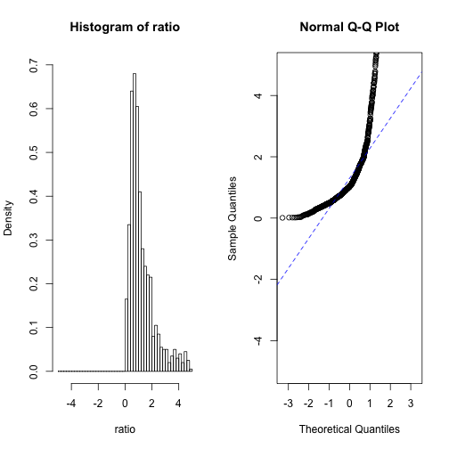
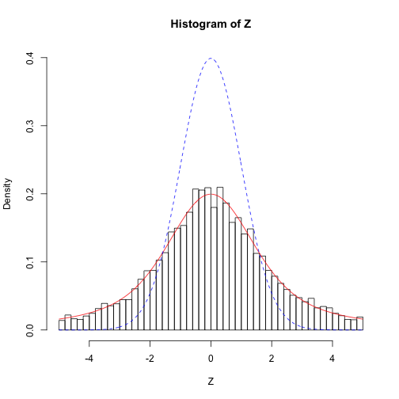
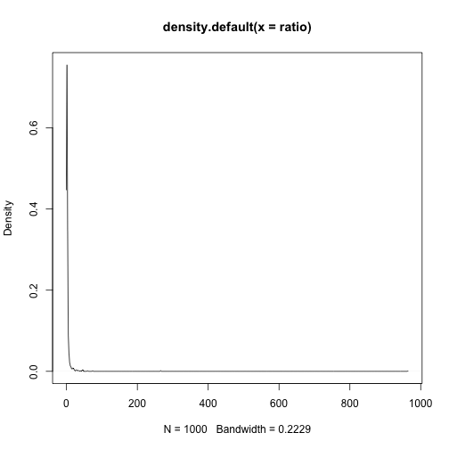
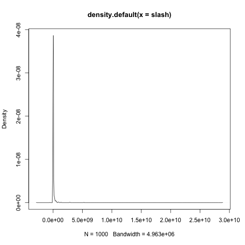

Progress 18/3/14
========================================================

It turns out that the ratio of a normal distribution to a uniform distribution is a *slash* distribution:


```r
# Homozygous SNP list (normal)
hm <- rnorm(10000, 1e+07, 5e+06)
remove <- c()
x <- 1
for (i in hm) {
    if (i < 0 || i > 18585056) {
        remove <- c(remove, x)
    }
    x <- x + 1
}
hm <- hm[-c(remove)]

# Heterozygous SNP list (uniform)
ht <- runif(10000, 1, 18585056)

# Ratio of samples
ratio <- sample(hm, 1000)/sample(ht, 1000)  # numer. and denom. must be same length
```


I have decided that a good way to work out the ratio is by taking samples of the SNP distributions, then calculating the ratio of the sample vectors. With the SNP lists I was using in [New_Model_Genome](https://github.com/edwardchalstrey1/fragmented_genome_with_snps/blob/normal/Progress/New_Model_Genome.md), this would not have been useful, as the number of homozygous SNPs in the model was so low.
From consulting literature that describes the kind of back-cross experiment I am modelling, including [Uchida et al (2011)](http://pcp.oxfordjournals.org/content/52/4/716.long), I have concluded that the actual numbers of SNPs can vary largely, based on the specific experiment. For subsequent versions of my model genome, I will use 10,000 of each kind of SNP. I can try and use experimental SNP data once I have got the genetic algorithm to re-order contigs from the model.


```r
par(mfrow = c(1, 2))  # puts 2 plots side by side

# Histogram of ratio
hist(ratio, xlim = c(-5, 5), breaks = c(-Inf, seq(-5, 5, 0.2), Inf), freq = F, 
    ylim = c(0, 0.7))

# Normal Q-Q plot
qqnorm(ratio, ylim = c(-5, 5))
qqline(ratio, xlim = c(-5, 5), lty = 2, col = "blue")
```

 


As the above figures show, the ratio does not follow a normal distribution. Instead, as illustrated by the example below, we will have a slash distribution.


```r
set.seed(123)
X <- rnorm(10000)
Y <- runif(10000)
Z <- X/Y
dslash <- function(x) (dnorm(0) - dnorm(x))/x^2

x <- seq(-5, 5, 0.02)
hist(Z, xlim = c(-5, 5), breaks = c(-Inf, seq(-5, 5, 0.2), Inf), freq = F, ylim = c(0, 
    0.4))
lines(x, dslash(x), xlim = c(-5, 5), col = "red")
lines(x, dnorm(x), xlim = c(-5, 5), col = "blue", lty = 2)
```

 

```r

qqnorm(Z, ylim = c(-5, 5))
qqline(Z, xlim = c(-5, 5), lty = 2, col = "blue")
```

 


If the ratio follows the slash distribution, then we should be able to use Q-Q plot to compare it with an example slash.


```r
plot(density(ratio))
```

 

```r
ratio
```

```
##    [1] 8.944e-01 4.624e+01 6.208e-01 3.163e+00 2.515e+00 1.119e+00
##    [7] 1.982e+00 7.633e-01 8.263e-01 4.008e-01 9.376e+00 3.666e-01
##   [13] 1.157e+00 1.931e-01 8.015e-01 9.189e-01 6.588e-01 1.756e+01
##   [19] 1.180e+00 8.014e-01 1.573e+00 1.380e+01 7.078e-01 8.603e-01
##   [25] 1.898e+00 1.511e+00 6.680e-01 9.523e-01 6.764e-01 1.665e+00
##   [31] 5.652e-01 5.539e-01 5.564e-01 6.409e+00 7.612e-01 7.219e-01
##   [37] 7.716e-01 7.997e-01 1.331e+00 1.021e+00 7.623e-01 6.384e-01
##   [43] 5.484e-01 3.037e+00 9.118e-01 1.543e+00 2.151e+00 4.058e+00
##   [49] 3.171e-01 1.074e+00 1.067e+00 5.759e-01 6.703e-01 3.360e-01
##   [55] 3.814e-01 1.073e+00 1.746e+00 4.895e-01 5.349e-01 1.710e+01
##   [61] 4.296e+00 1.016e+00 7.607e-01 2.389e+00 1.781e+00 1.912e+00
##   [67] 1.187e+00 1.746e+00 1.451e+00 5.778e-01 6.713e-01 1.864e+00
##   [73] 9.990e-01 8.533e-01 4.708e+00 6.059e-01 4.717e-01 3.904e-01
##   [79] 6.535e-01 6.916e-01 7.599e-01 1.442e+00 8.650e-01 5.343e-01
##   [85] 1.307e+00 3.899e+00 7.503e-01 5.522e+00 8.891e-01 1.137e-01
##   [91] 3.028e+00 2.082e+00 3.802e-01 7.003e+00 6.127e-01 5.961e+01
##   [97] 8.616e-03 2.313e+00 9.524e+00 2.490e+00 1.775e+00 3.174e+00
##  [103] 7.358e-01 7.951e-01 4.629e-01 1.250e-01 1.969e+00 6.292e-01
##  [109] 3.407e-01 9.509e-01 9.979e-01 1.757e+00 6.617e-01 6.225e-01
##  [115] 6.527e-01 8.196e-01 2.338e-01 6.779e-01 1.154e-01 2.761e+00
##  [121] 2.114e+00 8.608e-01 3.478e-01 2.676e-01 1.831e+00 8.893e-01
##  [127] 4.507e+00 2.397e+00 1.340e+00 3.652e-01 6.060e-01 3.672e+00
##  [133] 1.322e+00 1.257e+01 8.424e-01 3.857e-01 1.573e+00 1.017e+00
##  [139] 1.242e+00 1.428e+00 6.126e+00 8.618e-01 2.267e+00 8.061e-01
##  [145] 6.565e-01 1.200e+00 7.988e-01 1.580e+00 7.350e-01 8.658e-01
##  [151] 5.810e-01 1.252e+00 2.039e+00 1.199e+00 4.686e-01 4.438e-01
##  [157] 1.904e+00 5.922e-01 1.556e+00 7.200e-01 4.963e-01 1.232e+00
##  [163] 2.291e+00 3.462e-01 1.641e-01 6.387e+00 1.154e+00 9.829e-01
##  [169] 1.985e+00 5.636e-01 1.857e+00 2.848e-01 8.233e-01 2.914e+00
##  [175] 1.625e+00 1.388e+01 8.549e+00 6.888e-01 5.207e-01 6.917e-01
##  [181] 7.371e-01 2.885e+00 6.927e+00 8.879e-01 9.526e-01 9.357e-01
##  [187] 4.763e+00 4.178e+00 1.124e+00 9.631e-01 4.484e-01 3.012e-01
##  [193] 8.300e-01 1.682e+00 1.255e+00 1.755e+00 7.761e+00 2.724e-01
##  [199] 1.736e-01 6.816e-01 3.336e+01 8.291e-01 5.012e-01 4.554e-01
##  [205] 1.132e+00 8.382e-01 5.986e-01 2.998e+00 1.603e+00 1.527e+00
##  [211] 2.414e+00 5.535e+00 2.077e-01 3.500e-01 3.411e-01 4.342e-01
##  [217] 1.223e+00 2.952e+00 2.649e+00 1.142e+00 7.304e+00 1.750e+00
##  [223] 4.954e+00 8.371e-01 2.192e+00 7.935e-01 5.331e-01 1.509e+00
##  [229] 1.622e+00 3.237e+00 2.224e+00 3.981e+00 1.930e+00 1.901e-01
##  [235] 9.632e-01 2.723e+00 1.521e+00 1.047e+00 6.205e-01 1.620e+00
##  [241] 6.238e-01 8.638e-01 1.273e-01 8.666e-01 1.110e+00 4.710e-01
##  [247] 9.519e-01 2.414e+00 1.494e+00 1.819e+00 5.955e-01 5.052e-01
##  [253] 5.396e+00 7.118e-01 9.004e-01 4.130e+01 7.785e-01 3.617e-01
##  [259] 1.332e+00 3.828e-01 2.085e+00 5.291e-01 5.798e+00 8.342e-01
##  [265] 9.603e-01 2.415e+00 2.210e-01 4.176e-01 7.516e-01 2.516e+00
##  [271] 5.664e-01 7.235e-01 8.892e-01 7.720e-01 1.016e+00 7.762e-01
##  [277] 8.043e+00 2.773e+00 4.724e-01 1.397e+00 3.446e+00 1.976e+00
##  [283] 9.973e-01 6.839e-01 8.486e+00 7.202e-01 1.116e+01 3.473e-01
##  [289] 4.519e-01 1.756e+00 8.107e-01 3.792e+00 2.799e+00 1.219e+00
##  [295] 2.842e+00 1.718e+00 1.306e+00 1.776e+00 3.992e+00 3.464e-01
##  [301] 5.779e-01 5.824e-01 4.008e+00 7.811e-01 5.258e+00 1.012e+00
##  [307] 8.824e-01 5.556e-01 1.689e+00 6.227e-01 7.234e-01 1.848e+00
##  [313] 3.703e+00 7.398e-01 3.290e-01 1.418e+00 2.034e-02 5.626e-01
##  [319] 5.231e+00 1.733e+00 4.041e-01 2.239e+00 2.034e+00 5.918e-01
##  [325] 1.459e+00 2.658e+00 6.947e-01 2.238e+00 1.599e+00 9.697e-01
##  [331] 4.145e+00 1.700e-01 6.070e-01 2.968e+00 8.603e-01 9.569e-01
##  [337] 1.451e-01 2.238e+00 5.837e-01 7.154e-01 9.518e-01 1.469e+00
##  [343] 4.410e+00 6.789e-01 1.337e+00 1.305e+00 5.584e+00 1.762e+00
##  [349] 1.188e+01 1.176e+01 5.060e-01 4.283e+00 2.346e-01 1.690e-01
##  [355] 3.903e+00 4.572e+00 6.222e-01 4.147e-01 5.901e-01 1.548e+00
##  [361] 4.558e+01 3.274e-01 1.356e+00 5.211e+00 1.605e-01 9.743e-01
##  [367] 1.928e+00 2.512e-01 1.528e+00 6.114e-01 4.160e+00 4.486e-01
##  [373] 8.998e-01 9.511e-01 1.872e+00 1.460e+00 1.398e+00 1.359e+00
##  [379] 1.069e+00 2.260e+00 7.234e-01 5.519e+00 7.454e-01 9.987e-01
##  [385] 2.146e-01 4.713e-01 7.285e-01 2.342e+00 2.784e+00 5.079e-01
##  [391] 8.187e-01 1.704e+00 6.488e+00 2.086e+00 4.679e-01 7.978e-01
##  [397] 9.717e-01 5.113e-01 8.818e-01 5.238e-01 4.412e-01 6.585e-01
##  [403] 3.492e-01 1.861e+00 5.870e-01 4.637e-01 1.462e+00 1.064e+00
##  [409] 4.917e-01 7.503e-01 4.102e-01 4.674e-01 9.746e-01 2.773e+00
##  [415] 5.032e-01 2.821e+01 7.036e-01 1.938e+01 1.236e+00 1.475e+00
##  [421] 7.442e-01 1.289e+00 1.848e-02 9.336e-01 9.578e-01 2.538e+00
##  [427] 4.788e+00 9.443e-01 7.213e-01 3.779e+01 4.910e-01 1.332e-01
##  [433] 2.900e+00 3.673e+00 5.555e+00 8.338e-01 1.159e+00 2.757e-01
##  [439] 1.714e+00 1.298e+00 3.261e+00 6.473e-01 7.779e-01 2.674e-02
##  [445] 1.137e+00 1.439e+00 1.017e+00 1.456e+00 1.326e+00 7.317e-01
##  [451] 1.311e+00 9.552e-01 4.093e+00 1.754e+01 4.567e+00 5.785e+00
##  [457] 1.165e+00 2.638e+00 7.270e-01 7.496e-01 2.543e+00 1.061e+00
##  [463] 1.564e+00 7.043e-01 8.552e-01 3.440e-01 8.198e-01 2.284e+00
##  [469] 6.262e-01 7.888e-01 5.140e+00 1.309e+00 6.369e-01 1.774e+00
##  [475] 1.203e+00 9.862e-01 1.737e+00 4.635e-01 8.616e-02 5.346e+00
##  [481] 4.164e-01 2.210e-01 3.180e+00 8.876e-01 3.992e+00 2.002e+00
##  [487] 1.453e+00 1.798e+00 7.944e+00 3.155e+01 1.165e+00 2.375e+00
##  [493] 1.553e+00 6.603e-01 7.071e-01 2.472e+00 3.074e-01 1.331e+00
##  [499] 4.367e-01 4.021e-01 1.181e+00 4.403e+00 1.934e+00 5.868e-01
##  [505] 5.426e-01 2.142e+00 4.412e+00 9.753e-01 1.052e+00 1.194e+01
##  [511] 1.035e+00 5.880e-01 2.963e-01 4.694e-01 2.009e+01 2.842e-01
##  [517] 1.089e+00 1.299e+00 9.431e-01 1.062e+00 1.768e+00 8.456e-01
##  [523] 5.817e-01 4.505e-01 8.373e-01 5.592e-01 7.615e-01 5.331e-01
##  [529] 1.068e+00 4.015e-01 2.462e+00 2.378e+00 1.895e+00 5.097e-01
##  [535] 5.341e-02 1.378e+00 2.115e+01 1.967e+00 7.659e-01 7.421e-01
##  [541] 1.938e+00 1.702e+00 5.086e-01 8.568e-01 3.874e-01 4.835e-01
##  [547] 6.711e+00 1.108e+00 7.826e-01 1.439e+00 3.692e-01 1.195e+00
##  [553] 2.313e+00 1.980e+00 1.805e+00 1.822e+00 1.791e+00 4.555e+01
##  [559] 4.795e-01 3.783e+00 6.502e-01 7.370e+00 3.554e+00 1.123e+00
##  [565] 7.499e-01 1.882e+00 4.476e+00 5.791e-01 1.831e+01 3.351e-02
##  [571] 3.531e+00 8.272e-01 7.762e-01 6.848e-01 5.011e-01 1.515e+00
##  [577] 1.491e+00 6.212e-01 8.721e-01 1.138e+00 8.935e-02 5.744e-01
##  [583] 7.183e-01 4.030e-01 1.529e+00 1.019e+01 1.273e+00 9.768e-01
##  [589] 9.597e-01 1.034e+00 1.016e+00 1.069e+00 7.099e-01 4.968e-01
##  [595] 6.216e-01 8.780e-01 1.524e+00 1.652e+00 5.388e-01 6.887e-01
##  [601] 1.895e+00 1.925e+00 1.013e+00 9.236e-01 9.184e-01 1.290e+00
##  [607] 5.644e+00 4.400e+00 9.237e-01 6.593e-01 4.255e+00 1.097e+00
##  [613] 3.165e-01 7.484e-01 1.696e+00 3.299e-01 3.127e-01 4.923e-01
##  [619] 8.403e-01 2.798e-02 2.473e+00 1.974e+01 9.540e-01 4.583e-01
##  [625] 9.918e-01 9.214e+00 3.075e+00 7.902e-01 5.010e+00 5.051e-01
##  [631] 1.453e+00 4.435e+00 4.558e+01 9.859e-01 6.373e+00 6.993e-01
##  [637] 3.177e-01 3.160e+00 7.022e-01 1.015e+00 1.405e+00 8.727e-01
##  [643] 2.354e+00 6.912e-01 2.142e+00 5.069e+00 4.904e-01 1.936e+00
##  [649] 1.065e+00 1.867e+00 5.991e-01 1.728e-02 1.791e-02 4.511e-01
##  [655] 8.391e-01 4.527e-01 7.853e-01 1.398e+00 5.522e-01 1.076e+00
##  [661] 1.078e+00 1.339e+00 2.689e-01 9.523e-01 9.272e-01 4.854e-01
##  [667] 2.371e+00 5.729e+00 6.129e-01 1.167e+00 4.713e+00 7.378e+01
##  [673] 1.831e+00 4.168e+00 1.804e+00 8.399e-01 2.936e+00 1.214e+00
##  [679] 7.100e-01 1.132e+01 1.038e+00 8.293e-01 1.003e+00 6.652e+00
##  [685] 1.990e-01 3.042e+00 3.965e-01 3.418e-01 1.816e+00 4.455e-01
##  [691] 1.693e+00 3.620e+00 9.468e-01 9.477e-01 9.222e-01 6.864e-01
##  [697] 1.214e+00 5.581e-01 8.461e-01 4.287e+00 1.411e+00 1.822e+00
##  [703] 9.940e+00 1.778e+00 7.299e-01 8.848e-01 2.227e+01 6.545e-01
##  [709] 3.093e-01 1.346e+00 1.558e+00 1.007e+00 1.445e+00 1.870e+00
##  [715] 1.288e+00 7.152e+00 3.590e+00 1.957e+00 9.532e-01 4.414e-01
##  [721] 1.256e+00 2.798e+00 1.041e+00 7.410e-01 2.842e+00 5.945e-01
##  [727] 1.014e+01 3.684e-01 4.134e-01 1.002e+00 2.321e+00 4.453e-01
##  [733] 1.771e+00 1.121e+00 2.315e+00 8.908e+00 6.207e+00 2.400e+00
##  [739] 1.421e+00 2.657e+02 4.638e-01 3.503e+00 1.418e+01 6.683e+00
##  [745] 1.967e+00 2.688e+01 1.941e-01 1.364e+00 9.584e-01 8.314e-01
##  [751] 1.669e+00 5.391e-01 5.730e-01 1.513e+00 6.438e-01 6.496e+00
##  [757] 1.151e+00 1.491e+01 6.945e-01 9.924e-01 7.225e-01 3.772e-01
##  [763] 9.476e-01 8.693e-01 6.942e-01 9.331e-01 7.358e-01 1.177e+00
##  [769] 2.448e+00 1.724e+00 5.510e-01 5.752e+00 3.843e-01 7.315e-01
##  [775] 8.936e-01 2.077e+00 4.696e-01 1.203e+00 1.600e+00 1.418e+00
##  [781] 9.859e-01 3.090e-01 7.894e-01 5.568e-01 8.514e-01 1.053e+00
##  [787] 8.769e-01 1.240e+00 9.451e-01 1.211e-01 1.166e+00 9.620e-01
##  [793] 8.225e-01 1.464e+00 4.064e-01 7.512e-01 7.080e-01 2.828e+01
##  [799] 5.626e-01 5.213e-01 1.908e+00 1.662e+00 4.457e-01 7.640e-01
##  [805] 7.413e+00 2.109e+00 4.796e-01 6.753e-01 5.712e-01 2.120e+01
##  [811] 1.866e+00 1.002e+00 1.072e+00 4.104e-01 8.017e+00 3.375e+00
##  [817] 1.011e+00 6.251e-01 3.986e-01 2.207e+00 1.057e+00 5.027e-01
##  [823] 7.001e-01 1.378e+00 8.009e+00 1.806e+00 1.399e+00 2.432e+00
##  [829] 4.260e-01 1.671e-01 3.607e+00 1.127e+00 3.883e-01 4.826e-01
##  [835] 1.536e+01 2.596e+01 1.563e+00 9.412e-01 9.414e-01 2.124e+00
##  [841] 1.389e+00 7.484e-02 1.345e+00 1.075e+00 1.052e+00 1.362e+00
##  [847] 3.561e+00 6.214e-01 1.854e+00 6.132e-01 1.880e+01 4.058e-01
##  [853] 1.118e+01 2.523e+00 1.671e+01 7.767e-01 5.405e+00 1.105e-01
##  [859] 7.730e-01 3.330e-01 4.391e-01 3.466e+00 1.805e+00 6.008e-01
##  [865] 1.180e+00 3.738e+00 5.722e+00 3.261e-01 1.904e+00 4.776e-01
##  [871] 4.625e+00 7.819e-01 6.208e-01 1.404e+00 1.013e+00 7.688e+00
##  [877] 1.060e+00 1.613e+00 4.319e-01 1.226e+00 9.831e-01 6.822e-01
##  [883] 1.903e+00 3.094e-01 3.962e+00 1.054e+00 6.158e+00 6.994e+00
##  [889] 9.446e-02 2.176e+00 5.670e-01 1.166e+00 2.079e-01 1.670e+00
##  [895] 3.273e+01 3.918e-01 1.195e+00 1.039e+00 1.636e+00 1.378e+00
##  [901] 1.650e+00 1.390e+00 6.750e-01 1.158e+00 8.092e+00 9.860e-01
##  [907] 9.864e-01 2.960e+00 8.898e-01 3.016e-02 1.736e+00 3.172e+00
##  [913] 3.656e-01 1.708e+00 2.870e-01 1.072e+00 1.066e+00 2.317e+00
##  [919] 1.069e+01 1.316e+00 2.619e+00 8.272e-01 8.876e-01 2.076e-01
##  [925] 1.596e+00 7.095e-01 1.860e+01 8.420e-01 7.792e-01 5.035e-01
##  [931] 7.907e-01 3.761e+00 1.628e+00 1.590e+00 8.929e-01 6.586e-01
##  [937] 6.399e-01 1.110e+01 8.838e-01 4.135e-01 5.589e-01 9.645e+02
##  [943] 1.317e+00 2.022e-01 1.191e-01 1.119e+00 3.244e+00 1.025e+00
##  [949] 1.977e+00 5.434e-01 1.204e+00 5.533e-01 5.038e-01 2.898e-01
##  [955] 2.546e-01 2.426e+00 1.780e+00 1.476e+00 1.121e+00 1.542e+00
##  [961] 7.021e+00 4.846e-01 5.007e-01 7.502e-01 1.071e+00 1.022e+00
##  [967] 1.204e+00 3.666e+00 2.164e+00 4.550e-01 3.551e-01 4.740e-01
##  [973] 2.979e-01 4.101e-01 9.598e-01 6.079e+00 7.139e-01 3.185e+00
##  [979] 1.339e+00 1.414e+00 4.756e-01 1.273e+00 3.916e-01 4.016e+00
##  [985] 1.082e+00 5.162e+00 9.471e-01 5.429e+00 7.155e-01 9.062e-01
##  [991] 1.111e+00 2.944e-01 1.269e+00 1.017e+00 8.577e-01 6.829e-01
##  [997] 6.395e-01 1.307e+01 9.244e-01 2.441e+00
```

```r
library("VGAM", lib.loc = "/Library/Frameworks/R.framework/Versions/3.0/Resources/library")
```

```
## Warning: package 'VGAM' was built under R version 3.0.2
```

```
## Loading required package: splines
## Loading required package: stats4
## 
## Attaching package: 'VGAM'
## 
## The following object is masked _by_ '.GlobalEnv':
## 
##     dslash
## 
## The following object is masked from 'package:stats4':
## 
##     coef
## 
## The following object is masked from 'package:splines':
## 
##     bs, ns
## 
## The following objects are masked from 'package:stats':
## 
##     case.names, coef, coefficients, df.residual, dfbeta, fitted,
##     fitted.values, formula, hatvalues, poly, residuals,
##     variable.names, weights
## 
## The following object is masked from 'package:base':
## 
##     identity, scale.default
```

```r
slash <- rslash(1000, mu = 1e+07, sigma = 5e+06)
qqp <- qqplot(slash, ratio)
```

 

